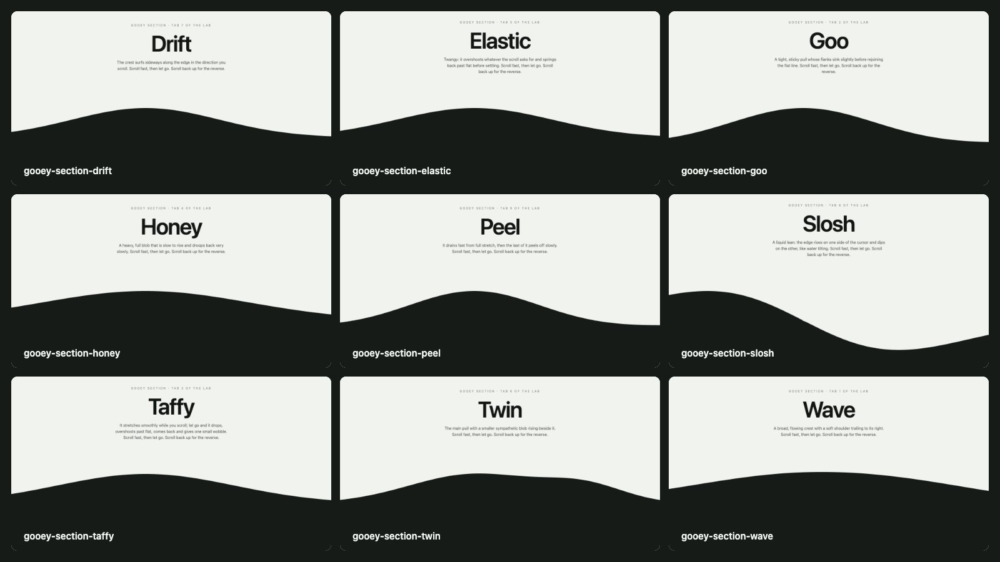

# Skills

Agent skills for building motion and interface on the web, with [Claude Code](https://claude.com/claude-code), Codex and other coding agents.



Most of these rebuild effects from Louis's motion labs, exactly. Instead of describing an animation and hoping the agent guesses the feel, a skill ships the lab's own engine, a working demo and the checks to prove the result matches.

Start with the section edges:

1. **[Gooey section: Goo](skills/sections/gooey-section-goo/SKILL.md)**
   The default feel. The boundary between two sections acts like a liquid surface pulled by scroll speed.
2. **[Gooey section: Taffy](skills/sections/gooey-section-taffy/SKILL.md)**
   Stretches while you scroll, then drops, overshoots and wobbles once when you let go.
3. **[Gooey section: Wave](skills/sections/gooey-section-wave/SKILL.md)**
   A broad, flowing crest with a soft shoulder. The calm one.

Browse [all demos and their prompts](DEMOS.md), or the [screenshot gallery](SCREENSHOTS.md).

---

## Agent support

Each skill is a plain folder: a `SKILL.md` playbook plus the files it needs.

- **Claude Code**: run `python3 install.py` to link every skill into `~/.claude/skills/`. Ask in your own words ("add the taffy goo between these sections") or call a skill directly with `/gooey-section-taffy`.
- **Codex**: copy a skill folder into your Codex skills directory. `agents/openai.yaml` gives Codex its display name, short description and default prompt. Invoke it with `$gooey-section-taffy`.
- **Cursor and other agents**: point the agent at the skill's `SKILL.md` and let it follow the steps and linked references.

---

## How these skills work

### Ship the engine, not a description
A feel lives in tuned numbers. A skill carries the original code as an asset, so the agent copies it instead of approximating it.

### Every feel has a demo
Each visual skill has a standalone `demo/index.html`, a rendered `preview.jpg` and the prompt that recreates it.

### Verified against the original
Skills built from a lab are checked frame by frame against that lab before they are published.

---

## Repo structure

```txt
skills/
  sections/
    README.md
    gooey-section-goo/
    gooey-section-taffy/
    ...
sources/
  gooey-section/        # shared engine and generator for the gooey family
scripts/                # previews, gallery, validation
install.py              # link skills into Claude Code
```

Folder contract:

```txt
skills/<category>/<skill-name>/
  SKILL.md            # required: frontmatter (name, description) + workflow
  REFERENCES.md       # optional: links only
  agents/openai.yaml  # interface metadata: display name, short description, default prompt
  assets/             # optional: code and files the skill hands to the agent
  references/         # optional: longer docs the skill points to
  scripts/            # optional: helper scripts
  demo/               # optional: visual proof
    index.html        # standalone HTML, CSS and JavaScript
    PROMPT.md         # minimal, recreation and remix prompts
    preview.jpg       # 1280 x 720 browser render
```

Conventions:
- `SKILL.md` is what the agent loads and follows. Keep it under about 500 lines and procedural: steps, defaults, guardrails.
- The `description` says what the skill does and when to use it. That is what an agent reads to decide.
- `REFERENCES.md` is links only.
- Skill names are unique across categories, because Claude Code installs them side by side.
- A family of generated skills keeps its sources in `sources/<family>/`. Edit those and rebuild; never edit the generated folders.

---

## Current library

<!-- library:start -->
This snapshot contains **9 skills** across 1 category. `find skills -name SKILL.md | sort` is the source of truth.

### Section Skills (9)

[Category guide](skills/sections/README.md)

- [`gooey-section-drift`](skills/sections/gooey-section-drift/SKILL.md) - Crest that surfs sideways as you scroll
- [`gooey-section-elastic`](skills/sections/gooey-section-elastic/SKILL.md) - Springy edge that overshoots and twangs back
- [`gooey-section-goo`](skills/sections/gooey-section-goo/SKILL.md) - Tight sticky bulge with sinking flanks
- [`gooey-section-honey`](skills/sections/gooey-section-honey/SKILL.md) - Heavy blob: slow rise, very slow droop
- [`gooey-section-peel`](skills/sections/gooey-section-peel/SKILL.md) - Fast drain from full stretch, slow peeling tail
- [`gooey-section-slosh`](skills/sections/gooey-section-slosh/SKILL.md) - Liquid lean: rises one side, dips the other
- [`gooey-section-taffy`](skills/sections/gooey-section-taffy/SKILL.md) - Stretches on scroll, snaps back with one wobble
- [`gooey-section-twin`](skills/sections/gooey-section-twin/SKILL.md) - Main bulge plus a smaller blob beside it
- [`gooey-section-wave`](skills/sections/gooey-section-wave/SKILL.md) - Broad flowing crest pulled by scroll speed
<!-- library:end -->

---

## Install

```bash
git clone https://github.com/ahoiadigital/claude-skills.git
cd claude-skills
python3 install.py
```

This links every skill into `~/.claude/skills/`. Because they are links, `git pull` updates them in place. Rerun `install.py` after adding a skill; it only replaces links that are broken or already point into this repo.

To install a single skill instead:

```bash
ln -s "$PWD/skills/sections/gooey-section-taffy" ~/.claude/skills/
```

---

## Adding a skill

1. Pick a category under `skills/`, or create one with a `README.md` (copy `skills/sections/README.md`).
2. Create `skills/<category>/<skill-name>/SKILL.md`, then add `agents/openai.yaml` and, if it has sources, `REFERENCES.md`.
3. For a visual skill, add `demo/index.html` and `demo/PROMPT.md`, then render the preview:
   ```bash
   node scripts/build-previews.cjs <skill-name>
   ```
   A demo can define `window.__demoPose()` to set up the frame worth capturing.
4. Refresh the lists and check the contract:
   ```bash
   node scripts/build-gallery.cjs
   node scripts/validate-skills.cjs
   ```
5. Run `python3 install.py`, then commit: small commits, one skill each, `Add <skill-name> skill` or `Update <skill-name> skill`.
