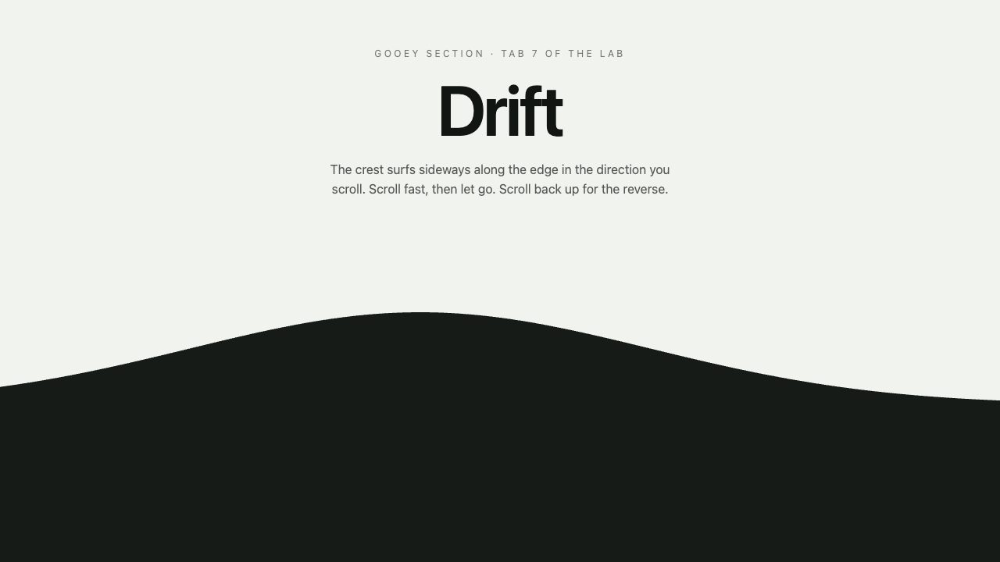
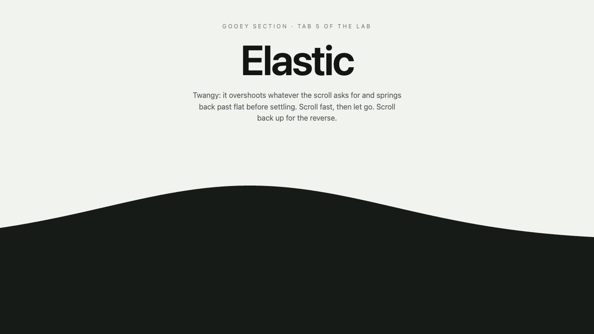
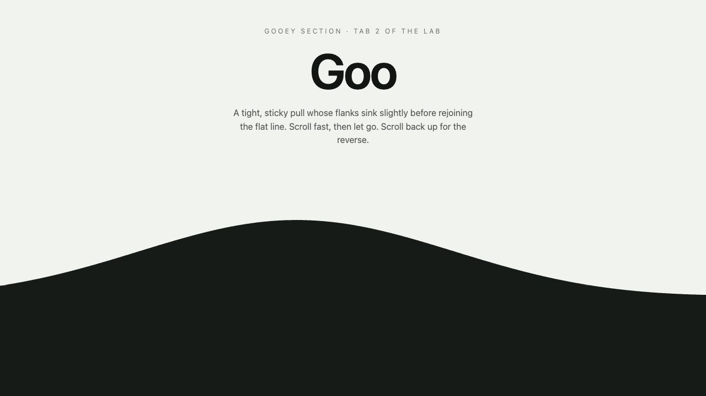
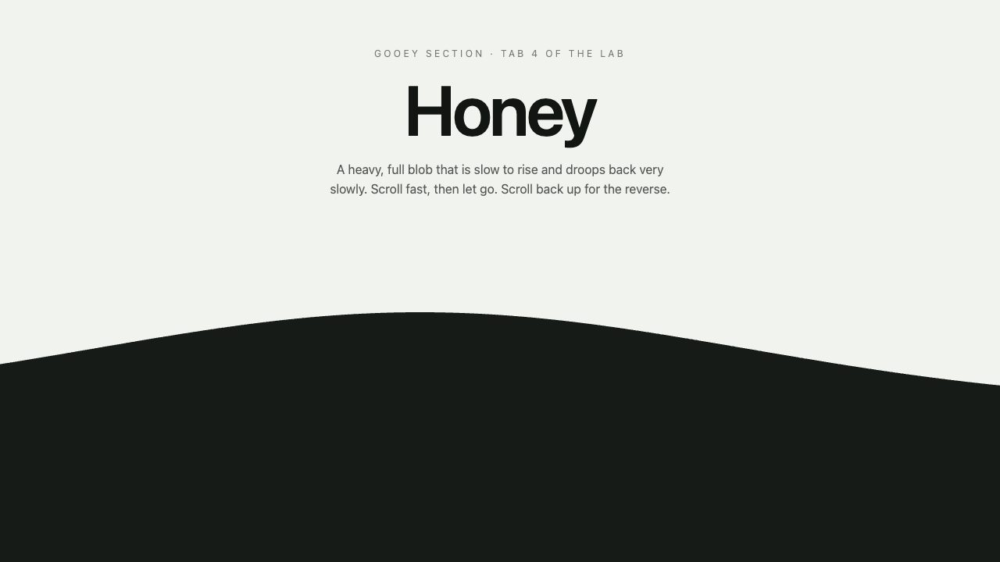
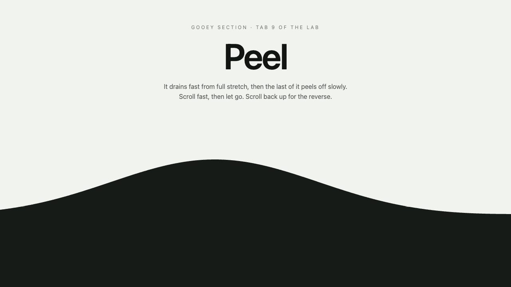
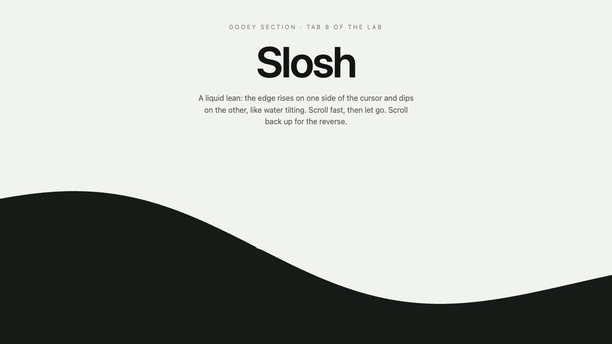
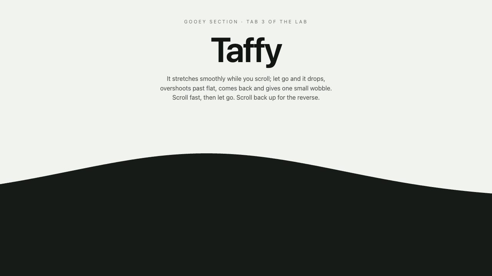
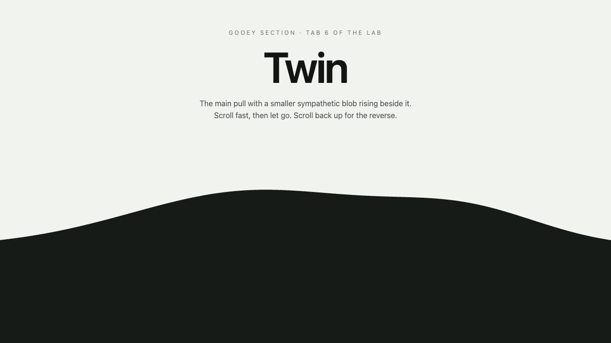
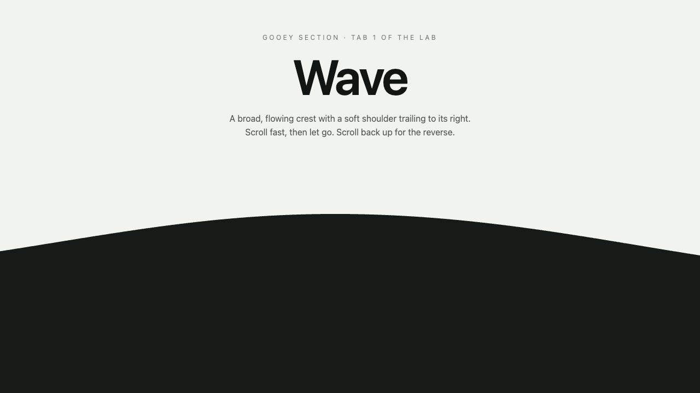

# Demo Screenshot Gallery

Every demo, rendered in a real browser at 1280 x 720. See [DEMOS.md](DEMOS.md) for how to run and rebuild them, or open the [visual gallery](SCREENSHOTS.html) locally.

- Captured demos: 9
- Format: JPEG

## sections (9)

### gooey-section-drift

Rebuilds the 'Drift' gooey section edge from Louis's motion labs (gooey-sections.html, tab 7): the crest surfs sideways along the edge in the direction you scroll. The boundary between two page sections acts like a liquid surface driven by scroll speed. Use this skill whenever the user asks for the drift goo or drift edge, or wants a section edge whose bulge travels or surfs sideways as you scroll, or for gooey sections tab 7, on a plain HTML page, a Webflow site or a React/Next.js app, even if they only name the feel. It ships a verified 1:1 port of the lab engine, so the result matches the lab exactly.

[Open demo](skills/sections/gooey-section-drift/demo/index.html) · [Skill](skills/sections/gooey-section-drift/SKILL.md) · [Prompt](skills/sections/gooey-section-drift/demo/PROMPT.md)

### gooey-section-elastic

Rebuilds the 'Elastic' gooey section edge from Louis's motion labs (gooey-sections.html, tab 5): twangy: it overshoots whatever the scroll asks for and springs back past flat before settling. The boundary between two page sections acts like a liquid surface driven by scroll speed. Use this skill whenever the user asks for the elastic goo or elastic edge, or wants a bouncy, springy, twangy or rubber-band section edge, or for gooey sections tab 5, on a plain HTML page, a Webflow site or a React/Next.js app, even if they only name the feel. It ships a verified 1:1 port of the lab engine, so the result matches the lab exactly.

[Open demo](skills/sections/gooey-section-elastic/demo/index.html) · [Skill](skills/sections/gooey-section-elastic/SKILL.md) · [Prompt](skills/sections/gooey-section-elastic/demo/PROMPT.md)

### gooey-section-goo

Rebuilds the 'Goo' gooey section edge from Louis's motion labs (gooey-sections.html, tab 2): a tight, sticky pull whose flanks sink slightly before rejoining the flat line. The boundary between two page sections acts like a liquid surface driven by scroll speed. Use this skill whenever the user asks for the goo edge, 'the goo one' or the sticky goo, or for gooey sections tab 2, on a plain HTML page, a Webflow site or a React/Next.js app, even if they only name the feel. This is the default feel: also use it when someone asks for a gooey, goo, liquid, blobby or melting section edge, divider or transition without naming a variant. It ships a verified 1:1 port of the lab engine, so the result matches the lab exactly.

[Open demo](skills/sections/gooey-section-goo/demo/index.html) · [Skill](skills/sections/gooey-section-goo/SKILL.md) · [Prompt](skills/sections/gooey-section-goo/demo/PROMPT.md)

### gooey-section-honey

Rebuilds the 'Honey' gooey section edge from Louis's motion labs (gooey-sections.html, tab 4): a heavy, full blob that is slow to rise and droops back very slowly. The boundary between two page sections acts like a liquid surface driven by scroll speed. Use this skill whenever the user asks for the honey goo or honey edge, or wants a heavy, slow, syrupy or droopy section edge, or for gooey sections tab 4, on a plain HTML page, a Webflow site or a React/Next.js app, even if they only name the feel. It ships a verified 1:1 port of the lab engine, so the result matches the lab exactly.

[Open demo](skills/sections/gooey-section-honey/demo/index.html) · [Skill](skills/sections/gooey-section-honey/SKILL.md) · [Prompt](skills/sections/gooey-section-honey/demo/PROMPT.md)

### gooey-section-peel

Rebuilds the 'Peel' gooey section edge from Louis's motion labs (gooey-sections.html, tab 9): it drains fast from full stretch, then the last of it peels off slowly. The boundary between two page sections acts like a liquid surface driven by scroll speed. Use this skill whenever the user asks for the peel goo or peel edge, or wants a section edge that lets go fast then lingers with a slow tail, or for gooey sections tab 9, on a plain HTML page, a Webflow site or a React/Next.js app, even if they only name the feel. It ships a verified 1:1 port of the lab engine, so the result matches the lab exactly.

[Open demo](skills/sections/gooey-section-peel/demo/index.html) · [Skill](skills/sections/gooey-section-peel/SKILL.md) · [Prompt](skills/sections/gooey-section-peel/demo/PROMPT.md)

### gooey-section-slosh

Rebuilds the 'Slosh' gooey section edge from Louis's motion labs (gooey-sections.html, tab 8): a liquid lean: the edge rises on one side of the cursor and dips on the other, like water tilting. The boundary between two page sections acts like a liquid surface driven by scroll speed. Use this skill whenever the user asks for the slosh goo or slosh edge, or wants a section edge that tilts, leans or sloshes like liquid, or for gooey sections tab 8, on a plain HTML page, a Webflow site or a React/Next.js app, even if they only name the feel. It ships a verified 1:1 port of the lab engine, so the result matches the lab exactly.

[Open demo](skills/sections/gooey-section-slosh/demo/index.html) · [Skill](skills/sections/gooey-section-slosh/SKILL.md) · [Prompt](skills/sections/gooey-section-slosh/demo/PROMPT.md)

### gooey-section-taffy

Rebuilds the 'Taffy' gooey section edge from Louis's motion labs (gooey-sections.html, tab 3): it stretches smoothly while you scroll; let go and it drops, overshoots past flat, comes back and gives one small wobble. The boundary between two page sections acts like a liquid surface driven by scroll speed. Use this skill whenever the user asks for the taffy goo or taffy edge, or wants a scroll-driven section edge that stretches and then snaps back with a single wobble, or for gooey sections tab 3, on a plain HTML page, a Webflow site or a React/Next.js app, even if they only name the feel. It ships a verified 1:1 port of the lab engine, so the result matches the lab exactly.

[Open demo](skills/sections/gooey-section-taffy/demo/index.html) · [Skill](skills/sections/gooey-section-taffy/SKILL.md) · [Prompt](skills/sections/gooey-section-taffy/demo/PROMPT.md)

### gooey-section-twin

Rebuilds the 'Twin' gooey section edge from Louis's motion labs (gooey-sections.html, tab 6): the main pull with a smaller sympathetic blob rising beside it. The boundary between two page sections acts like a liquid surface driven by scroll speed. Use this skill whenever the user asks for the twin goo or twin edge, or wants a section edge with two blobs or a double bulge, or for gooey sections tab 6, on a plain HTML page, a Webflow site or a React/Next.js app, even if they only name the feel. It ships a verified 1:1 port of the lab engine, so the result matches the lab exactly.

[Open demo](skills/sections/gooey-section-twin/demo/index.html) · [Skill](skills/sections/gooey-section-twin/SKILL.md) · [Prompt](skills/sections/gooey-section-twin/demo/PROMPT.md)

### gooey-section-wave

Rebuilds the 'Wave' gooey section edge from Louis's motion labs (gooey-sections.html, tab 1): a broad, flowing crest with a soft shoulder trailing to its right. The boundary between two page sections acts like a liquid surface driven by scroll speed. Use this skill whenever the user asks for the wave goo, the wave edge, the wave section divider, 'the wave one' or Louis's favourite goo, or for gooey sections tab 1, on a plain HTML page, a Webflow site or a React/Next.js app, even if they only name the feel. It ships a verified 1:1 port of the lab engine, so the result matches the lab exactly.

[Open demo](skills/sections/gooey-section-wave/demo/index.html) · [Skill](skills/sections/gooey-section-wave/SKILL.md) · [Prompt](skills/sections/gooey-section-wave/demo/PROMPT.md)

